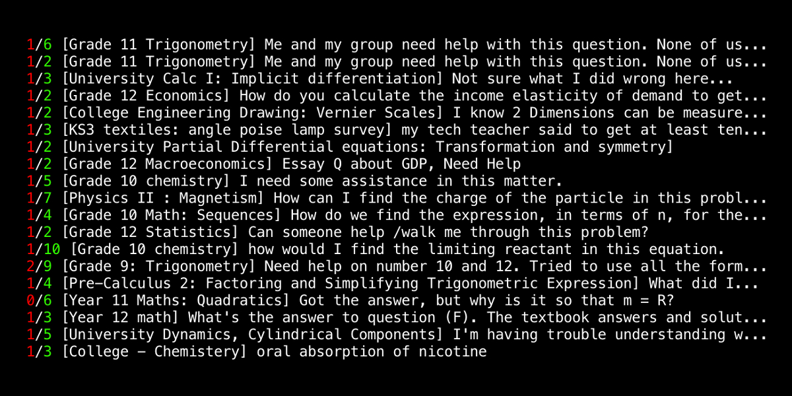

## Reddit Duplicate Comment Remover v2

Removes duplicate comments on subreddit/s. Can be used to target individual users.

### Instructions

-   Install requirements `pip install -r requirements.txt`
-   Create Reddit (script) app at <https://www.reddit.com/prefs/apps/> and get keys
-   Edit conf.ini with your details
-   Run it `python run.py`

### Settings Info

-   `target_subreddit` - Bot account must be mod
-   `submission_limit` - How many submissions to check each run
-   `sleep_time` - How many minutes to sleep between runs

### Help

    usage: run.py [-h] [-t] [-u USER] [-o]

    Duplicate Comment Remover v2 (by /u/impshum)

    optional arguments:
      -h, --help            show this help message and exit
      -t, --test            test mode
      -u USER, --user USER  target individual user
      -o, --once            run only once

### Notes

-   Red number is total duplicate comments
-   Green number is total unique comments
-   White text is the submission title
-   If you're not using Unix you won't see the colours in the terminal (command prompt). Follow [THIS](https://recycledrobot.co.uk/words/?print-python-colours) tutorial to get them working.
-   I will not be held responsible for any bad things that might happen to you or your Reddit account whilst using this bot. Follow Reddiquette and stay safe.

### Tip

BTC - 1AYSiE7mhR9XshtS4mU2rRoAGxN8wSo4tK
